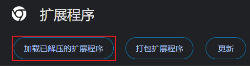

# MyChromeExtensions

## Extentions

### Hello

A demo of chrome extension.

### AutoFocus

Auto focus on the input when you activate your baidu/google tab, so you don't need to touch your mouse any more.

### SearchingInGoogle

When you see some words or expressions that you do not understand, you can press 'ctrl+x' to open a new tab and search it on google.

### RmMaskInRarbg

To remove mask in rarbg.

### CustomizeKeys

To customize your own shortkeys in chrome.

## Usages

1. Open your chrome
2. Typing 'chrome://extensions' in address bar
3. 
4. Choose the path of specific extension
5. Test it