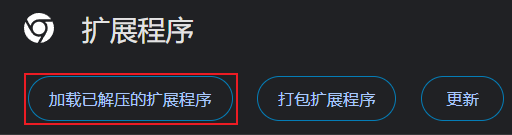

# MyChromeExtensions

## Extentions

### Hello

A demo of chrome extension.

### AutoFocus

Auto focus on the input when you activate your baidu/google tab, so you don't need to touch your mouse any more.

### SearchingInGoogle

When you see some words or expressions that you do not understand, you can press 'ctrl+x' to open a new tab and search it on google.

### RmMaskInRarbg

To remove mask in rarbg.

### CustomizeKeys

To customize your own shortkeys in chrome.

### VideoSpeed

Press 'alt+up'/'alt+down' to speed up/slow down the video you are watching, and the left/right arrow keys to seek backward/forward 15 seconds, and Space to play/pause (these only kick in when the page has a video, so they won't hijack the keys elsewhere). On YouTube it also auto-skips ads: it mutes each ad and seeks it straight to the end, which works on non-skippable ads too.

### RegexFilter

Press 'ctrl+q' to open a regex box; matching text on the page is highlighted. Enter jumps to the next match, Shift+Enter to the previous, Esc clears everything.

## Usages

1. Open your chrome
2. Typing 'chrome://extensions' in address bar
3. 
4. Choose the path of specific extension
5. Test it